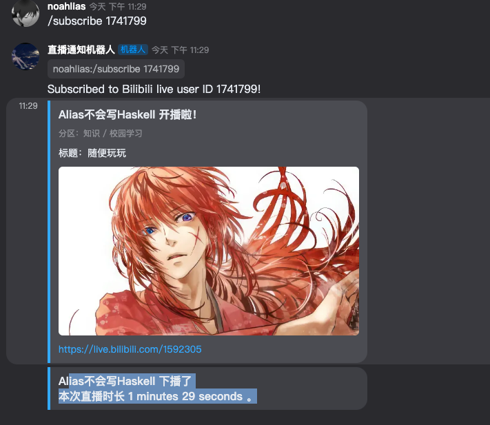

# Kook_Live_Bot

This is a bot for Kook Live.



## Features

- [x] Subscribe BiliBili live room
- [x] Unsubscribe BiliBili live room
- [x] Auto push live stream message to chat channel.


## Getting Started

You should copy `.env.example` to `.env` and fill in the required values.

```bash
$ docker-compose up -d
```

### Prerequisites

`poetry` is required to install dependencies.

```bash
$ pip install poetry
```

And then install dependencies.

```bash
$ poetry install
```

## Thanks

- [khl.py](https://github.com/TWT233/khl.py)
- [Harukubot](https://github.com/SK-415/HarukaBot/)